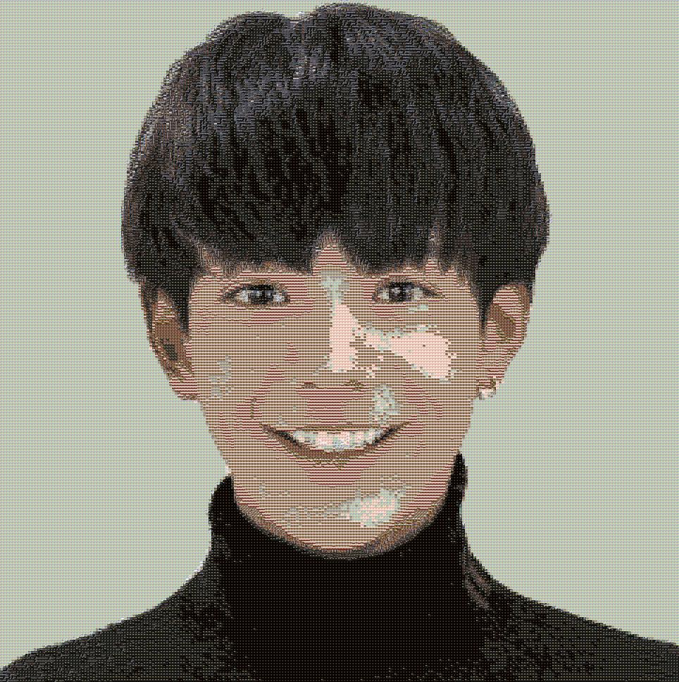
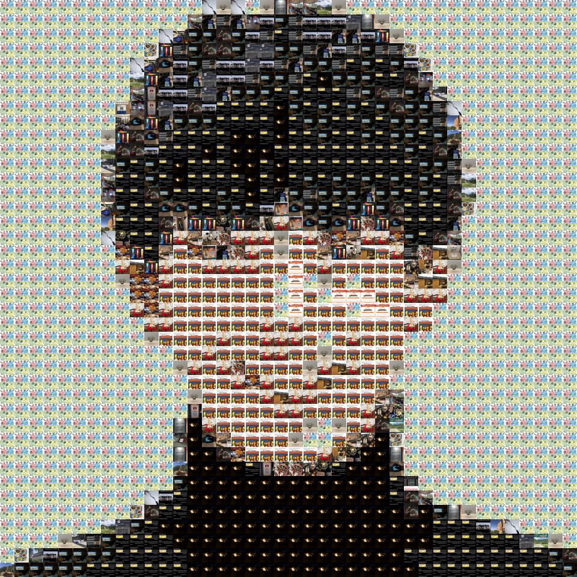
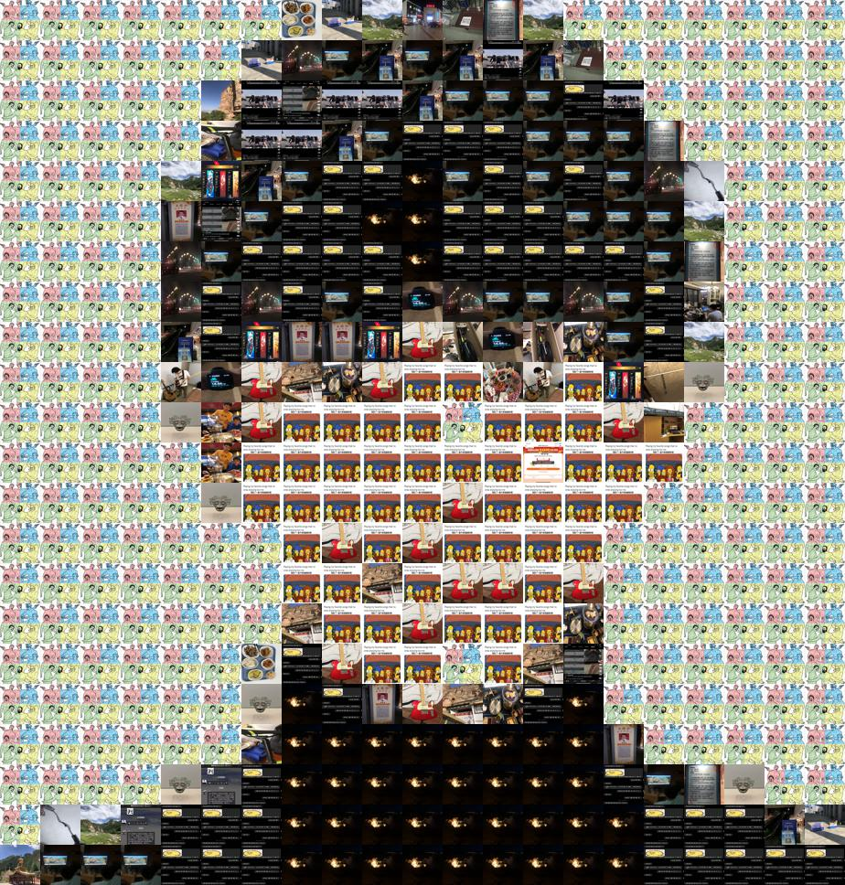

# Result
## Original

## Mosaicked (using photos shot by myself)

# Method
1. Prepare many small images 
    * e.g. photos from phone album
2. Chooose A big target image 
    * e.g. 丁真
3. Split big image into chunks of pixels (COP)
4. Use the small image which has **the closest average color** to the COP to **replace** it.

***details in main.ipynb***

